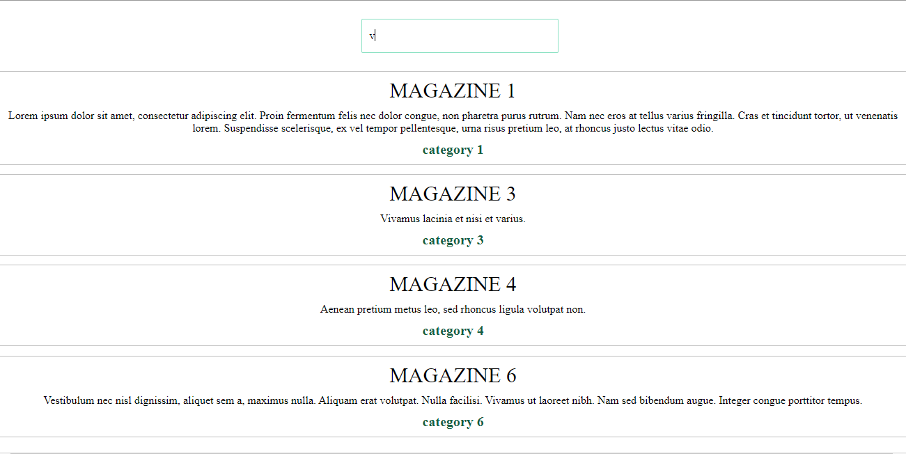

# Dynamic 'search' on data elements

## Link
[https://anna-koziol.github.io/dynamic-search/](https://anna-koziol.github.io/dynamic-search/)

## What Is This?
This small project allows to dynamic searching elements from json and append them to page according to importance.

## How To Use?
* Open file index.html on Your broweser and start use, you can enter text to input (id = "search-button"). This program will check if text from input contain in data (name, category and description), if so - append this element on page. Matches are positioned on page by name, category and description.

## License
This project is released under the MIT Licence.

## Author
Anna Koziol

## Screen

